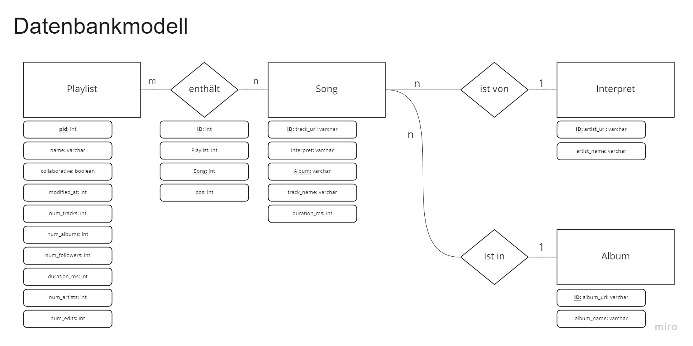

# Spotify Recommender Systems

<t style="color: #1DB954; font-size: xx-large; font-weight: bold;">Spotify</t> 
<t style="color: #BA3FC9; font-size: xx-large; font-weight: bold;">Million</t> 
<t style="color: #239CDE; font-size: xx-large; font-weight: bold;">Playlist</t>
<t style="color: #E6CA17; font-size: xx-large; font-weight: bold;">Dataset</t>

Gruppenprojekt Wintersemester 2021/22

## Die Challenge 🥇

Unter [Spotify Million Playlist Dataset Challenge](https://www.aicrowd.com/challenges/spotify-million-playlist-dataset-challenge) gibt es eine Challenge, zum erstellen eines Recommender Systems, mit Hilfe eines riesigen Datensatzes von Spotify Playlisten. Ziel ist es, verschiedene Ansätze auszuprobieren, um Recommender Systeme für diese Daten zu erstellen, um mehr über verschiedene Recomender Taktiken zu lernen.

Weitere Ansätze [hier](https://www.recsyschallenge.com/2018/).

## Datensatz 📊

Der Datensatz besteht aus 1.000.000 Playlisten mit über 2.000.000 einzelnen Tracks und ca. 300.000 Interpreten, erstellt von Nutzern zwischen January 2010 und Oktober 2017.

## Data-Warehouse 🏡<-📦

Die Daten aus besagtem Datensatz werden als erstes gesammelt in eine Datenbank geschrieben. Im Code verwenden wir eine Datenbank, die auf unserem Hochschulnetzwerk läuft, aber es hindert natürlich nichts daran, sich selbst ne Datenbank dafür zu erstellen. Den Datensatz selbst muss man sich hierfür ja auch selbst besorgen.

### ER-Model 📈

Und so sieht unser Datenbankmodell aus, in das wir den Datensatz laden:

Für die, die Zugang haben: https://miro.com/app/board/uXjVOcp6pwA=/


## Recommender 🧐

### Collaborative Filtering

Mein erster Ansatz ist das sogenannte Collaborative Filtering. Dabei wird geschaut, was im Trainingsdatensatz für Items miteinander kollaborieren und darauf aufbauend eine Art Rating erstellt, wie gut welche Items zueinander passen. Am besten kann man es mit folgender Tabelle verbildlichen:

```
            | LoveSong 1 | LoveSong 2 | RockSong 1 | RockSong 2 | MetalSong 1
------------+------------+------------+------------+------------+-------------
LoveSong 1  |     1      |     0.8    |     0.1    |    -0.2    |    -0.3     
LoveSong 2  |     0.8    |     1      |    -0.1    |    -0.15   |    -0.2     
RockSong 1  |     0.1    |    -0.1    |     1      |     0.9    |     0.4     
RockSong 2  |    -0.2    |    -0.15   |     0.9    |     1      |     0.7     
MetalSong 1 |    -0.3    |    -0.2    |     0.4    |     0.7    |     1       
```

Die Vorgehensweise für das Erstellen und Anwenden einer solchen Recommendatoin Tabelle steht in den Jupiter Files selbst kommentiert.

### KNN - K Nearest Neighbour

Der noch nicht implementierte nächste Ansatz ist das KNN Verfahren, das nach similarity der Items selbst geht, also Attribute der Items. Da der gegebene Datensatz keine nützlichen Attribute für einen guten KNN Algorythmus liefert. Muss hier **Datamining** betrieben werden. Der Plan ist, mittels Spotify API an mehr Daten der Tracks zu kommen, wie zum Beispiel Genres. Mit einem Aufbereiteten und erweiterten Datensatz kann dann weiter gearbeitet werden.